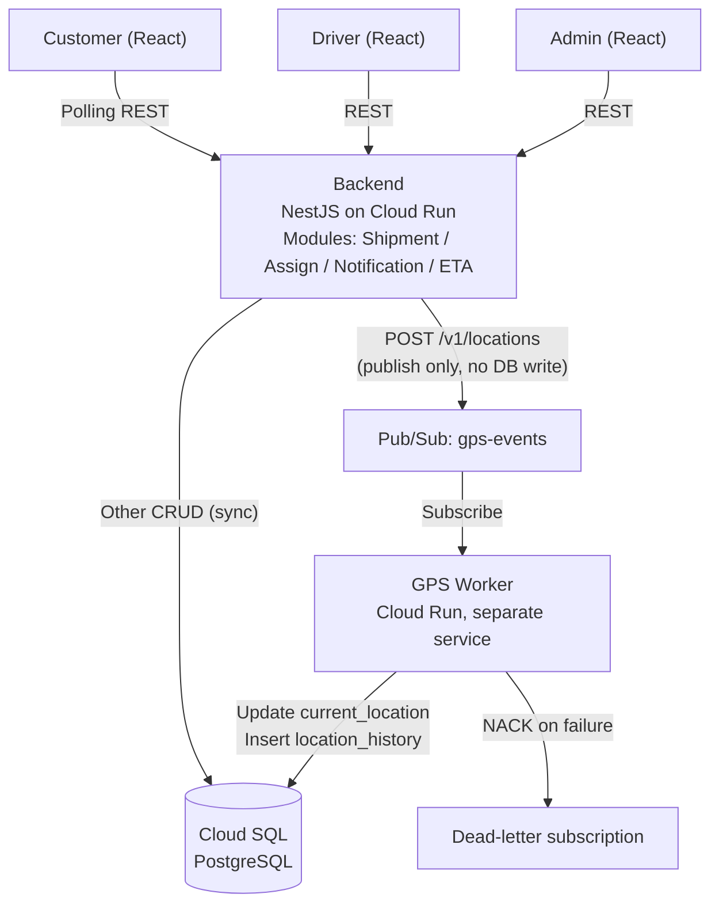

# ParcelFlow

**A logistics & delivery platform built "Cloud First" - Modular Monolith + async processing for high-throughput GPS data.**

| | |
|---|---|
| **Course** | Cloud Application Development - UET |
| **Topic** | Logistic & Delivery Platform |
| **Team size** | 6 students |
| **Timeline** | 10 weeks |
| **Primary focus** | Performance & Scalability |

---

## Quick Start (Worker)

Monorepo/Worker dùng Node.js >= 22.12 (Pub/Sub client hiện yêu cầu Node 22;
Node hiện đại cũng hỗ trợ nạp NestJS 12 ESM từ build CommonJS).

```powershell
# Cài sạch dependencies theo lockfile gốc (API/frontend vẫn có lockfile riêng)
npm ci --ignore-scripts --no-audit --no-fund

# PowerShell: chỉ tạo .env nếu chưa có, không ghi đè cấu hình cá nhân
if (!(Test-Path .env)) { Copy-Item .env.example .env }

# Chạy worker ở chế độ development
npm run start:dev

# Build
npm run typecheck
npm run build

# Kiểm tra health endpoint
curl http://localhost:8080/healthz

# Chạy test
npm test
npm run test:e2e

# Lint
npm run lint
```

Để thử pipeline local, bật Docker và chạy
`docker compose -f infra/docker-compose.yml up -d pubsub-emulator`, rồi chạy
`sh infra/pubsub/bootstrap.sh` trong Git Bash/WSL để tạo topic/subscription.

`.env.example` ở gốc là template chung; Worker local cần `PORT`, `GCP_PROJECT_ID`,
`PUBSUB_SUBSCRIPTION` và `PUBSUB_EMULATOR_HOST`, dùng project `parcelflow-dev`
trên Pub/Sub emulator. Health `GET /healthz` là liveness: HTTP 200 không chứng minh
pipeline Pub/Sub hoạt động; nếu chưa bật emulator, Worker có thể log lỗi kết nối.
API dùng `apps/api/.env.example`; frontend không nhận credentials của Worker/API.
Không đặt `PUBSUB_EMULATOR_HOST` trên Cloud Run; dùng project thật và ADC do TV5 cấu hình.

Typecheck/test ở gốc chỉ kiểm tra Worker và cấu hình Vitest, không gom code React
hoặc test API. Chạy riêng API bằng `npm run typecheck --workspace=@parcelflow/api`
và `npm test --workspace=@parcelflow/api`; frontend dùng `npm run lint:web`,
`npm run build:web`, `npm run dev:web`. Sau khi đổi compiler config trong VS Code,
chạy **TypeScript: Restart TS Server** nếu Problems vẫn hiển thị lỗi cũ.

---

## Table of Contents

1. [Overview](#1-overview)
2. [Functional Scope (MVP)](#2-functional-scope-mvp)
3. [System Architecture](#3-system-architecture)
4. [Tech Stack & Infrastructure](#4-tech-stack--infrastructure)
5. [Non-Functional Requirements](#5-non-functional-requirements)
6. [Roadmap](#6-roadmap)

---

## 1. Overview

ParcelFlow is a delivery and logistics platform designed around a **Modular Monolith** architecture, combined with **asynchronous processing** for high-load data flows.

The goal is an MVP that:

- Covers the core shipment lifecycle end to end.
- Demonstrates **scalability** and **fault tolerance** for the driver GPS tracking pipeline.

## 2. Functional Scope (MVP)

### User roles

- **Customer**
- **Driver**
- **Admin** — shipment dispatching, driver assignment and operational monitoring.

### Shipment state flow (single flow)

```
CREATED → ASSIGNED → PICKED_UP → DELIVERED / DELIVERY_FAILED
```

### Core use cases

| # | Use case |
|---|----------|
| 1 | Create shipment |
| 2 | Assign shipment to driver |
| 3 | Update pickup/delivery status |
| 4 | Submit driver location periodically (**async**) |
| 5 | Track shipment status |
| 6 | View delivery history |
| 7 | Handle failed/late delivery |
| 8 | Customer notifications |
| 9 | *Advanced:* ETA prediction (Haversine formula) |

### Out of scope

Multiple redelivery attempts, returns, COD, multi-warehouse management, Machine Learning for ETA, route recommendation, PostGIS.

## 3. System Architecture

The system uses a **Modular Monolith** for business logic, plus an **Event-Driven / Async pipeline** dedicated to GPS ingestion.

### 3.1. Architecture diagram



### 3.2. Processing flows

#### 1. General business flow (synchronous)

All business operations (create shipment, assign, notifications, auth, ...) go through synchronous REST calls from the client to the NestJS backend, which writes directly to PostgreSQL.

#### 2. GPS flow (asynchronous)

To meet the load requirements, the **write path** and **read path** of GPS data are fully separated:

- **Write path (driver sends GPS):** The driver calls `POST /v1/locations`. The backend only **publishes** a message to Google Cloud Pub/Sub and immediately returns `HTTP 202` (draft) - it does not wait for a database write.
- **Background processing (worker):** A standalone service (**GPS Worker**) subscribes to Pub/Sub and writes the data into Cloud SQL.
- **Read path (customer tracking):** The Customer app uses **REST polling** (every 5 to 10s) to read the `current_location` table from Postgres.

#### 3. Data integrity: idempotency & out-of-order handling

Each GPS event carries the payload `(driver_id, client_timestamp, lat, lng)`. The worker guarantees integrity through database-level constraints:

- **`location_history`**: `INSERT ... ON CONFLICT (driver_id, client_timestamp) DO NOTHING` to drop duplicate events.
- **`current_location`**: `UPDATE ... WHERE client_timestamp > existing.client_timestamp` to ignore late (out-of-order) events.

#### 4. Failure recovery scenario

Pub/Sub combined with a **dead-letter subscription** ensures location data is not lost when the worker fails. Messages remain in the queue and are processed as a backlog once the worker is back online.

## 4. Tech Stack & Infrastructure

| Component | Technology |
|-----------|------------|
| Frontend | React + Vite + TypeScript |
| Backend core | NestJS (deployed on Google Cloud Run) |
| GPS Worker | NestJS / Node.js script (separate Google Cloud Run service) |
| Message queue | Google Cloud Pub/Sub |
| Database | PostgreSQL (Google Cloud SQL) |
| Authentication | Firebase Authentication |
| Maps | Leaflet + OpenStreetMap |
| CI/CD | GitHub Actions |
| Monitoring | Google Cloud Monitoring |

## 5. Non-Functional Requirements

Design assumptions: at any moment there are **~300–500 active shipments**, and drivers send GPS **every 8 seconds**.

| Metric (NFR) | Target | Rationale |
|--------------|--------|-----------|
| Throughput (normal) | ~60 events/s | 500 drivers × 1 event / 8 s |
| Throughput (load test, ~5×) | ~300 events/s | Demonstrates scalability via load testing |
| p95 latency - Create/Assign | < 500 ms | Synchronous transactional write |
| p95 latency - Tracking read | < 300 ms | Indexed table read |
| p95 latency - GPS ingest ack | < 150 ms | Pub/Sub publish latency only (independent of DB) |
| Worker recovery time | < 60 s | Time to drain the backlog after the worker is stopped and restarted (measured via Cloud Monitoring) |
| Cloud budget | < $50 / month | Cost optimization: Cloud Run scale-to-zero, lowest Cloud SQL tier, Pub/Sub free tier |

## 6. Roadmap

| Week | Focus | Milestone |
|------|-------|-----------|
| 1 | Init repo, React + NestJS skeleton. Set up Cloud Run, Cloud SQL, Pub/Sub. | Base URLs live, health checks pass on both services. Budget alert configured. |
| 2 | Integrate Auth, design Postgres schema, complete Create Shipment API. | Customer can log in; created shipments persist in Cloud SQL. |
| 3 | Assign shipment + Admin/Driver UI. Define GPS event schema. | Admin can assign a driver. Driver can publish a test message to Pub/Sub. |
| 4 | Pickup/Delivery status updates. GPS Worker starts consuming the queue. | Basic delivery flow works. Location is persisted to the DB via the worker. |
| 5 | Complete the end-to-end GPS pipeline. Dedupe / out-of-order handling. | Customer sees near real-time driver location (polling). **Mandatory** |
| 6 | Failed/Late delivery handling, Notification module. | All required use cases complete. |
| 7 | ETA prediction (Haversine) based on `current_location`. | Customer sees ETA alongside tracking. |
| 8 | Integration & permission tests. Prepare load-test and recovery scenarios. | System stable; failure-simulation scenario ready. |
| 9 | Run load tests per NFRs. Finalize Cloud Monitoring data, fix bugs. | Load-test report (performance & scalability); Release Candidate. |
| 10 | Finalize documentation and final risk contingency. | Packaged product; metrics ready for the defense. |

## Week 1 API scaffold

The API now boots with Shipment, Auth and Admin modules and exposes public `GET /healthz`. Shipment/Admin business handlers and database access remain deferred. See [run and container instructions](docs/api-scaffold.md) and the [contract draft decisions](docs/api-contract.md). `docs/openapi.json` is a future API draft; cancellation is an unapproved proposal outside the five-state baseline. Cloud Run deployment evidence is tracked in issue #9.

## Frontend integration and Hosting

The shared React frontend lives in `apps/web`. Routes are `/customer`, `/driver`,
and `/admin`; Admin includes dispatching and driver assignment. The role contract
is `CUSTOMER`, `DRIVER`, `ADMIN`. Authentication, shipment submission, and driver
positions currently use scaffold/mock data; merging the apps does not activate
the future business APIs.

From the repository root:

```bash
cd apps/web
npm ci --workspaces=false
npm run lint
npm run build
npm run dev
```

Deploy the built frontend from `apps/web`:

```bash
npx --yes firebase-tools deploy --only hosting --project int3326e
```

Firebase CLI must be authenticated with access to `int3326e`. `firebase.json`
publishes `dist` and rewrites SPA routes to `index.html`, including direct access
to `/admin`. Hosting: https://int3326e.web.app.

Keep the API's standalone package and lockfile as documented in
`docs/api-scaffold.md`. Each app is installed from its own lockfile; `apps.zip`
is excluded from the repository.
