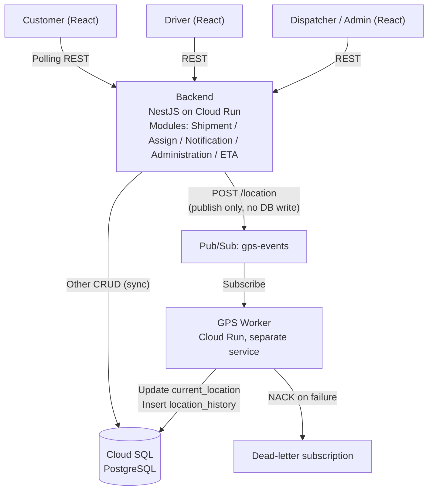

<<<<<<< HEAD
<p align="center">
  <a href="http://nestjs.com/" target="blank"></a>
</p>

[circleci-image]: https://img.shields.io/circleci/build/github/nestjs/nest/master?token=abc123def456
[circleci-url]: https://circleci.com/gh/nestjs/nest

  <p align="center">A progressive <a href="http://nodejs.org" target="_blank">Node.js</a> framework for building efficient and scalable server-side applications.</p>
    <p align="center">
<a href="https://www.npmjs.com/~nestjscore" target="_blank"></a>
<a href="https://www.npmjs.com/~nestjscore" target="_blank"></a>
<a href="https://www.npmjs.com/~nestjscore" target="_blank"></a>
<a href="https://circleci.com/gh/nestjs/nest" target="_blank"></a>
<a href="https://discord.gg/G7Qnnhy" target="_blank"></a>
<a href="https://opencollective.com/nest#backer" target="_blank"></a>
<a href="https://opencollective.com/nest#sponsor" target="_blank"></a>
  <a href="https://paypal.me/kamilmysliwiec" target="_blank"></a>
    <a href="https://opencollective.com/nest#sponsor"  target="_blank"></a>
  <a href="https://twitter.com/nestframework" target="_blank"></a>
</p>
  <!--[](https://opencollective.com/nest#backer)
  [](https://opencollective.com/nest#sponsor)-->

## Description

[Nest](https://github.com/nestjs/nest) framework TypeScript starter repository.

## Project setup

```bash
$ npm install
```

## Compile and run the project

```bash
# development
$ npm run start

# watch mode
$ npm run start:dev

# production mode
$ npm run start:prod
```

## Run tests

```bash
# unit tests
$ npm run test

# e2e tests
$ npm run test:e2e

# test coverage
$ npm run test:cov
```

## Deployment

When you're ready to deploy your NestJS application to production, there are some key steps you can take to ensure it runs as efficiently as possible. Check out the [deployment documentation](https://docs.nestjs.com/deployment) for more information.

If you are looking for a cloud-based platform to deploy your NestJS application, check out [Mau](https://mau.nestjs.com), our official platform for deploying NestJS applications on AWS. Mau makes deployment straightforward and fast, requiring just a few simple steps:

```bash
$ npm install -g @nestjs/mau
$ mau deploy
```

With Mau, you can deploy your application in just a few clicks, allowing you to focus on building features rather than managing infrastructure.

## Observability

In production applications, observability is essential for understanding how your system behaves, detecting issues early, and maintaining reliable performance.

[NestJS Observe](https://observe.nestjs.com) automatically instruments your NestJS application, giving you deep visibility into your system with minimal setup:

- **Distributed tracing:** Follow requests across services and understand how they flow through your system.
- **Waterfall analysis:** Visualize request execution and identify slow operations, bottlenecks, and unexpected delays.
- **Performance analysis:** Analyze application performance in real time and quickly pinpoint areas that need optimization.
- **Metrics:** Track key application and infrastructure metrics to understand system health and performance trends.
- **Logging:** Centralize and correlate logs with traces and other telemetry to make debugging easier.
- **Error tracking:** Detect errors quickly and investigate their root causes with the surrounding context.
- **SLA monitoring:** Track service-level objectives and identify when your application is approaching or exceeding defined thresholds.
- **Alarms and alerts:** Set up alerts for critical errors, performance degradation, SLA violations, and other anomalies so your team can react quickly.

This project is already instrumented. Create a free account at [observe.nestjs.com](https://observe.nestjs.com), add an application, and paste the generated app key and secret into the `ObserveModule.forRoot()` call in `src/app.module.ts`.

The free plan needs no payment details and covers 300,000 events a month. You can also browse the [live demo](https://www.observe-demo.nestjs.com/dashboard) first - the whole dashboard over a busy service's data, with nothing to install.

## Resources

Check out a few resources that may come in handy when working with NestJS:

- Visit the [NestJS Documentation](https://docs.nestjs.com) to learn more about the framework.
- For questions and support, please visit our [Discord channel](https://discord.gg/G7Qnnhy).
- To dive deeper and get more hands-on experience, check out our official video [courses](https://courses.nestjs.com/).
- Deploy your application to AWS with the help of [NestJS Mau](https://mau.nestjs.com) in just a few clicks.
- Auto-instrument your application with [NestJS Observe](https://observe.nestjs.com). Distributed tracing, metrics, and logging made easy. Error tracking and performance monitoring for your NestJS applications.
- Visualize your application graph and interact with the NestJS application in real-time using [NestJS Devtools](https://devtools.nestjs.com).
- Need help with your project (part-time to full-time)? Check out our official [enterprise support](https://enterprise.nestjs.com).
- To stay in the loop and get updates, follow us on [X](https://x.com/nestframework) and [LinkedIn](https://linkedin.com/company/nestjs).
- Looking for a job, or have a job to offer? Check out our official [Jobs board](https://jobs.nestjs.com).

## Support

Nest is an MIT-licensed open source project. It can grow thanks to the sponsors and support by the amazing backers. If you'd like to join them, please [read more here](https://docs.nestjs.com/support).

## Stay in touch

- Author - [Kamil Myśliwiec](https://twitter.com/kammysliwiec)
- Website - [https://nestjs.com](https://nestjs.com/)
- Twitter - [@nestframework](https://twitter.com/nestframework)

## License

Nest is [MIT licensed](https://github.com/nestjs/nest/blob/master/LICENSE).
=======
# ParcelFlow

**A logistics & delivery platform built "Cloud First" - Modular Monolith + async processing for high-throughput GPS data.**

| | |
|---|---|
| **Course** | Cloud Application Development - UET |
| **Topic** | Logistic & Delivery Platform |
| **Team size** | 6 students |
| **Timeline** | 10 weeks |
| **Primary focus** | Performance & Scalability |

---

## Table of Contents

1. [Overview](#1-overview)
2. [Functional Scope (MVP)](#2-functional-scope-mvp)
3. [System Architecture](#3-system-architecture)
4. [Tech Stack & Infrastructure](#4-tech-stack--infrastructure)
5. [Non-Functional Requirements](#5-non-functional-requirements)
6. [Roadmap](#6-roadmap)

---

## 1. Overview

ParcelFlow is a delivery and logistics platform designed around a **Modular Monolith** architecture, combined with **asynchronous processing** for high-load data flows.

The goal is an MVP that:

- Covers the core shipment lifecycle end to end.
- Demonstrates **scalability** and **fault tolerance** for the driver GPS tracking pipeline.

## 2. Functional Scope (MVP)

### User roles

- **Customer**
- **Driver**
- **Dispatcher**
- **Administrator**

### Shipment state flow (single flow)

```
CREATED → ASSIGNED → PICKED_UP → DELIVERED / DELIVERY_FAILED
```

### Core use cases

| # | Use case |
|---|----------|
| 1 | Create shipment |
| 2 | Assign shipment to driver |
| 3 | Update pickup/delivery status |
| 4 | Submit driver location periodically (**async**) |
| 5 | Track shipment status |
| 6 | View delivery history |
| 7 | Handle failed/late delivery |
| 8 | Customer notifications |
| 9 | *Advanced:* ETA prediction (Haversine formula) |

### Out of scope

Multiple redelivery attempts, returns, COD, multi-warehouse management, Machine Learning for ETA, route recommendation, PostGIS.

## 3. System Architecture

The system uses a **Modular Monolith** for business logic, plus an **Event-Driven / Async pipeline** dedicated to GPS ingestion.

### 3.1. Architecture diagram



### 3.2. Processing flows

#### 1. General business flow (synchronous)

All business operations (create shipment, assign, notifications, auth, ...) go through synchronous REST calls from the client to the NestJS backend, which writes directly to PostgreSQL.

#### 2. GPS flow (asynchronous)

To meet the load requirements, the **write path** and **read path** of GPS data are fully separated:

- **Write path (driver sends GPS):** The driver calls `POST /location`. The backend only **publishes** a message to Google Cloud Pub/Sub and immediately returns `HTTP 200` - it does not wait for a database write.
- **Background processing (worker):** A standalone service (**GPS Worker**) subscribes to Pub/Sub and writes the data into Cloud SQL.
- **Read path (customer tracking):** The Customer app uses **REST polling** (every 5 to 10s) to read the `current_location` table from Postgres.

#### 3. Data integrity: idempotency & out-of-order handling

Each GPS event carries the payload `(driver_id, client_timestamp, lat, lng)`. The worker guarantees integrity through database-level constraints:

- **`location_history`**: `INSERT ... ON CONFLICT (driver_id, client_timestamp) DO NOTHING` to drop duplicate events.
- **`current_location`**: `UPDATE ... WHERE client_timestamp > existing.client_timestamp` to ignore late (out-of-order) events.

#### 4. Failure recovery scenario

Pub/Sub combined with a **dead-letter subscription** ensures location data is not lost when the worker fails. Messages remain in the queue and are processed as a backlog once the worker is back online.

## 4. Tech Stack & Infrastructure

| Component | Technology |
|-----------|------------|
| Frontend | React + Vite + TypeScript |
| Backend core | NestJS (deployed on Google Cloud Run) |
| GPS Worker | NestJS / Node.js script (separate Google Cloud Run service) |
| Message queue | Google Cloud Pub/Sub |
| Database | PostgreSQL (Google Cloud SQL) |
| Authentication | Firebase Authentication |
| Maps | Leaflet + OpenStreetMap |
| CI/CD | GitHub Actions |
| Monitoring | Google Cloud Monitoring |

## 5. Non-Functional Requirements

Design assumptions: at any moment there are **~300–500 active shipments**, and drivers send GPS **every 8 seconds**.

| Metric (NFR) | Target | Rationale |
|--------------|--------|-----------|
| Throughput (normal) | ~60 events/s | 500 drivers × 1 event / 8 s |
| Throughput (load test, ~5×) | ~300 events/s | Demonstrates scalability via load testing |
| p95 latency - Create/Assign | < 500 ms | Synchronous transactional write |
| p95 latency - Tracking read | < 300 ms | Indexed table read |
| p95 latency - GPS ingest ack | < 150 ms | Pub/Sub publish latency only (independent of DB) |
| Worker recovery time | < 60 s | Time to drain the backlog after the worker is stopped and restarted (measured via Cloud Monitoring) |
| Cloud budget | < $50 / month | Cost optimization: Cloud Run scale-to-zero, lowest Cloud SQL tier, Pub/Sub free tier |

## 6. Roadmap

| Week | Focus | Milestone |
|------|-------|-----------|
| 1 | Init repo, React + NestJS skeleton. Set up Cloud Run, Cloud SQL, Pub/Sub. | Base URLs live, health checks pass on both services. Budget alert configured. |
| 2 | Integrate Auth, design Postgres schema, complete Create Shipment API. | Customer can log in; created shipments persist in Cloud SQL. |
| 3 | Assign shipment + Dispatcher/Driver UI. Define GPS event schema. | Dispatcher can assign a driver. Driver can publish a test message to Pub/Sub. |
| 4 | Pickup/Delivery status updates. GPS Worker starts consuming the queue. | Basic delivery flow works. Location is persisted to the DB via the worker. |
| 5 | Complete the end-to-end GPS pipeline. Dedupe / out-of-order handling. | Customer sees near real-time driver location (polling). **Mandatory** |
| 6 | Failed/Late delivery handling, Notification module, Admin dashboard. | All required use cases complete. |
| 7 | ETA prediction (Haversine) based on `current_location`. | Customer sees ETA alongside tracking. |
| 8 | Integration & permission tests. Prepare load-test and recovery scenarios. | System stable; failure-simulation scenario ready. |
| 9 | Run load tests per NFRs. Finalize Cloud Monitoring data, fix bugs. | Load-test report (performance & scalability); Release Candidate. |
| 10 | Finalize documentation and final risk contingency. | Packaged product; metrics ready for the defense. |
>>>>>>> origin/develop
