# Driver Frontend & GPS Emitter — Week 1 Specification

| Thuộc tính | Giá trị |
| --- | --- |
| Dự án | ParcelFlow MVP |
| Module | Driver Frontend và GPS emitter |
| Phối hợp kỹ thuật | TV3: ghép emitter vào khung giao diện Driver và kiểm tra Start/Stop; TV2: GPS pipeline; Hạ tầng: GCP |
| Giai đoạn | Tuần 1 |
| Trạng thái tài liệu | Đặc tả phạm vi tuần 1; payload GPS còn là bản nháp |

## 1. Mục tiêu và căn cứ

Phạm vi tuần 1 dựa trên `ParcelFlow - Bảng theo dõi tiến độ.xlsx`, sheet `Tiến độ 10 Tuần`, ô D7:

1. Thử publish/consume thông điệp “hello world” qua Pub/Sub, phối hợp với phần GPS pipeline.
2. Phác thảo component GPS emitter.

Kết quả cần đạt: nhận được thông điệp qua Pub/Sub và có component trên `/driver` tạo payload tọa độ mẫu theo chu kỳ 8 giây, hỗ trợ bắt đầu/dừng và quan sát kết quả.

Theo yêu cầu cập nhật tuần 1, Hello World đã đạt và không cần thử lại. TV4 phối hợp TV3 ghép emitter vào Driver, kiểm tra Start/Stop và sửa tham chiếu contract thành `POST /v1/locations`.

Checkpoint dự án tuần 1 tại ô F4 còn yêu cầu URL chung truy cập được, health check của hai Cloud Run service trả 200 và topic/subscription tồn tại. Nghiệm thu Driver Frontend và emitter là một phần của checkpoint; bằng chứng triển khai và health check cần được xác nhận riêng.

## 2. Phạm vi

### 2.1. Trong tuần 1

- Giữ kết quả publish/pull Hello World đã đạt trong project `int3326e`; không yêu cầu chạy lại.
- Dùng route `/driver` và layout hiện có để hiển thị GPS emitter.
- Dùng tài xế mẫu `demo-driver-1` và tọa độ cố định `{ lat: 21.0285, lng: 105.8542 }`.
- Tạo payload trong trình duyệt, hiển thị mẫu gần nhất và tổng số mẫu đã tạo.
- Cung cấp callback đồng bộ tùy chọn `onEmit` làm điểm nối cho bước tích hợp sau.
- Dọn timer khi dừng, khi dependency thay đổi hoặc khi component bị unmount.

### 2.2. Ngoài phạm vi tuần 1

Đăng nhập Driver, lấy GPS thật, simulator có chuyển động, gắn emitter với trạng thái đơn hàng, gửi GPS qua REST, worker ghi vị trí vào Cloud SQL, retry, dedupe, xử lý out-of-order và load test.

Các mục này được triển khai theo roadmap ở mục 8. Riêng thử nghiệm Pub/Sub và bản phác thảo emitter là hai phép thử độc lập trong tuần 1, chưa tạo thành pipeline GPS từ Driver đến cloud. Frontend publish trực tiếp lên Pub/Sub không thuộc kiến trúc tích hợp của dự án.

## 3. Thử nghiệm Pub/Sub

### 3.1. Điều kiện và dữ liệu thử

| Mục | Giá trị hoặc điều kiện |
| --- | --- |
| Project | `int3326e` |
| Subscription trong ảnh | `hello-test-sub` |
| Tên resource | `projects/int3326e/subscriptions/hello-test-sub` |
| Topic thử nghiệm | `hello-test` — `projects/int3326e/topics/hello-test`; ảnh bổ sung ngày 09/10/2026 hiển thị topic cùng subscription `hello-test-sub` |
| Message body | `Hello World` |
| Điều kiện trước khi chạy | Topic và subscription tồn tại; tài khoản thử nghiệm có quyền publish/pull tương ứng |

`gps-events` là tên topic GPS trong kiến trúc và cấu hình mẫu của repo. Topic dùng cho phép thử này là `hello-test`, gắn với subscription `hello-test-sub`; không dùng `gps-events` thay cho tên topic thực tế trong biên bản thử nghiệm.

### 3.2. Yêu cầu

| ID | Yêu cầu | Tiêu chí đạt |
| --- | --- | --- |
| PS-01 | Publish thông điệp lên topic thử nghiệm đã xác định. | Lưu tên topic và kết quả publish thành công. |
| PS-02 | Pull thông điệp từ subscription của topic đó. | Message body nhận được là `Hello World`; lưu ảnh hoặc log nhận thông điệp. |
| PS-03 | Ghi nhận kết quả thử nghiệm Pub/Sub. | Có project, topic, subscription, nội dung gửi/nhận, thời điểm thử và kết quả. Nếu có ACK, ghi riêng bằng chứng ACK. |

Việc nhìn thấy message trong màn hình Pull chứng minh bước nhận thông điệp của phép thử. Không suy ra worker đã xử lý message, đã ACK hoặc đã ghi dữ liệu vào DB từ ảnh này.

## 4. Component GPS emitter

### 4.1. Vị trí và giao diện lập trình

- Component: `apps/web/src/features/driver/GpsEmitter.tsx`.
- Trang sử dụng: `apps/web/src/features/driver/DriverPlaceholderPage.tsx`.
- Layout: `apps/web/src/layouts/DriverLayout.tsx`.
- Route: `/driver`, khai báo trong `apps/web/src/App.tsx`.

| Prop | Kiểu | Bắt buộc | Ý nghĩa |
| --- | --- | --- | --- |
| `driverId` | `string` | Có | Định danh tài xế được đưa vào từng payload. Trang mẫu truyền `demo-driver-1`. |
| `onEmit` | `(event: GpsEmitterDraftEvent) => void` | Không | Nhận payload tại mỗi nhịp phát. Tuần 1 chưa gắn callback gửi mạng. |

Luồng xử lý tuần 1:

```text
Bắt đầu → timer 8 giây → tọa độ cố định + timestamp mới
                     → hiển thị payload, tăng số mẫu, gọi onEmit nếu có
Dừng / unmount       → hủy timer
```

### 4.2. Payload nội bộ

| Trường | Kiểu | Quy tắc |
| --- | --- | --- |
| `driverId` | `string` | Lấy từ prop; chỉ cho bắt đầu khi `driverId.trim()` không rỗng. |
| `lat` | `number` | Vĩ độ theo độ thập phân; mẫu cố định `21.0285`, thuộc khoảng `[-90, 90]`. |
| `lng` | `number` | Kinh độ theo độ thập phân; mẫu cố định `105.8542`, thuộc khoảng `[-180, 180]`. |
| `clientTimestamp` | `string` | Thời điểm tạo mẫu bằng `new Date().toISOString()`, định dạng ISO 8601 UTC. |

Ví dụ minh họa, không phải log thử nghiệm:

```json
{
  "driverId": "demo-driver-1",
  "lat": 21.0285,
  "lng": 105.8542,
  "clientTimestamp": "2026-10-09T02:00:08.000Z"
}
```

Kiểu `GpsEmitterDraftEvent` là dữ liệu nội bộ của bản phác thảo. `GpsTelemetryEvent` trong `packages/types/src/index.ts` còn có `eventId`, `seq`, `receivedAt`. Phần Driver Frontend và GPS pipeline cần thống nhất contract GPS và nơi tạo từng trường ở tuần 2; payload bốn trường trên chưa phải schema REST hoặc Pub/Sub chính thức. Kiểm tra tọa độ stale/invalid thuộc tuần 5; tọa độ cố định hợp lệ chưa đủ để xác nhận việc xử lý các trường hợp này.

### 4.3. Yêu cầu hành vi và giao diện

| ID | Yêu cầu | Tiêu chí đạt |
| --- | --- | --- |
| GPS-01 | Khởi tạo ở trạng thái dừng. | Hiển thị “Đã dừng”, số mẫu `0`, thông báo chưa có mẫu; nút Dừng bị vô hiệu hóa. |
| GPS-02 | Bắt đầu phát khi người dùng bấm nút và định danh hợp lệ. | Hiển thị “Đang phát mẫu”; nút Bắt đầu bị vô hiệu hóa, nút Dừng được bật. Định danh rỗng hoặc chỉ có khoảng trắng không cho bắt đầu. |
| GPS-03 | Phát theo chu kỳ mục tiêu 8.000 ms. | Không phát ngay khi bấm; nhịp đầu tạo một mẫu sau một chu kỳ, mỗi nhịp sau tăng số mẫu một lần và tạo timestamp mới. |
| GPS-04 | Hiển thị kết quả phát. | Hiển thị JSON của mẫu gần nhất, tài xế mẫu và tổng số mẫu trong lần mount hiện tại. |
| GPS-05 | Dừng phát khi bấm Dừng. | Hủy timer; số mẫu và payload gần nhất giữ nguyên, không tạo thêm mẫu khi tiếp tục chờ. |
| GPS-06 | Bắt đầu lại sau khi dừng. | Chờ một chu kỳ mới rồi phát tiếp; số mẫu tiếp tục tăng từ giá trị đã giữ, không tạo timer trùng. |
| GPS-07 | Dọn tài nguyên đúng vòng đời. | Hủy timer cũ trước khi tạo timer mới khi `running`, `driverId` hoặc `onEmit` thay đổi; hủy timer khi unmount. Mount mới trở về trạng thái ban đầu. |
| GPS-08 | Chạy độc lập với GPS thật và cloud. | Component không xin quyền vị trí, không gửi request GPS, vẫn tạo được mẫu khi chưa nối backend. |

Callback `onEmit` cần giữ reference ổn định nếu phía gọi muốn giữ nhịp phát liên tục. Một render với callback mới sẽ làm effect dọn và tạo lại timer khi đang chạy.

Chu kỳ 8 giây là mục tiêu khi trang hoạt động. Timer có thể bị trì hoãn khi tab ở nền; bản phác thảo chưa cam kết gửi đều trong nền trên điện thoại. Giao diện dùng layout Driver hiện có, có vùng trạng thái `role="status"` và vùng JSON cho phép cuộn ngang.

## 5. Kịch bản nghiệm thu

Chạy `npm run dev:web` tại root repo, mở URL mà Vite in ra và vào `/driver`. Kiểm tra timer khi tab đang hoạt động.

| Ca kiểm tra | Thao tác | Kết quả mong đợi |
| --- | --- | --- |
| TC-01 | Mở mới `/driver`. | Trạng thái dừng, số mẫu `0`, chưa có JSON; Bắt đầu bật, Dừng tắt. |
| TC-02 | Bấm Bắt đầu, quan sát trước và sau chu kỳ đầu. | Chưa có mẫu ngay khi bấm; sau khoảng 8 giây có mẫu thứ nhất với đúng bốn trường ở mục 4.2. |
| TC-03 | Chờ thêm một chu kỳ. | Số mẫu thành `2`; tọa độ không đổi, timestamp mới khác timestamp trước. |
| TC-04 | Bấm Dừng, ghi lại JSON và số mẫu, chờ hơn 8 giây. | Trạng thái dừng; JSON và số mẫu không đổi. |
| TC-05 | Bấm Bắt đầu lại, thử bấm lặp và chờ hai chu kỳ. | Nút Bắt đầu bị vô hiệu hóa khi chạy; số mẫu chỉ tăng một lần mỗi nhịp, không tăng theo nhiều timer. |
| TC-06 | Khi đang chạy, chuyển sang route khác rồi quay lại `/driver`. | Instance cũ được dọn; instance mới dừng, số mẫu `0`, chưa có JSON. |
| TC-07 | Kiểm tra prop bằng `driverId` rỗng hoặc chỉ có khoảng trắng trong môi trường phát triển. | Không cho bắt đầu, không tạo mẫu. Không đổi tài xế mẫu trên trang bàn giao. |
| TC-08 | Quan sát quyền vị trí và Network trong lúc phát mẫu. | Emitter không yêu cầu quyền vị trí và không phát sinh request gửi GPS. |
| TC-09 | Đối chiếu bằng chứng Hello World đã có; không chạy lại. | Đã đạt theo yêu cầu cập nhật tuần 1. |

Kiểm tra kỹ thuật bằng script sẵn có: `npm run lint:web` và `npm run build:web`. Các lệnh và ca kiểm tra trên là kế hoạch nghiệm thu; chỉ xác nhận đạt sau khi chạy và ghi nhận kết quả thực tế.

## 6. Bằng chứng hiện có

Ngày 09/10/2026 bổ sung 10 ảnh do TV4 cung cấp, lưu tại `docs/evidence/week-1/`, và cập nhật ảnh mẫu thứ nhất. Bộ ảnh xác định topic/subscription, ghi nhận publish/pull `Hello World`, giao diện emitter ban đầu, khi có một mẫu, hai mẫu và khi dừng, cùng kết quả kiểm tra kỹ thuật. Kết luận dưới đây dựa trên nội dung ảnh và kết quả lệnh đã chạy; không suy ra các ca kiểm tra chưa có bằng chứng. Các yêu cầu lưu bằng chứng chi tiết tại PS-01 đến PS-03 và mục 7 là checklist của tài liệu này; ô D7 không yêu cầu riêng ảnh publish thành công, ACK hoặc worker consume bằng code.

### 6.1. Pub/Sub Hello World

Hai ảnh ban đầu được giữ lại để đối chiếu:

Ảnh 1 — Subscription `hello-test-sub` trong project `int3326e`:

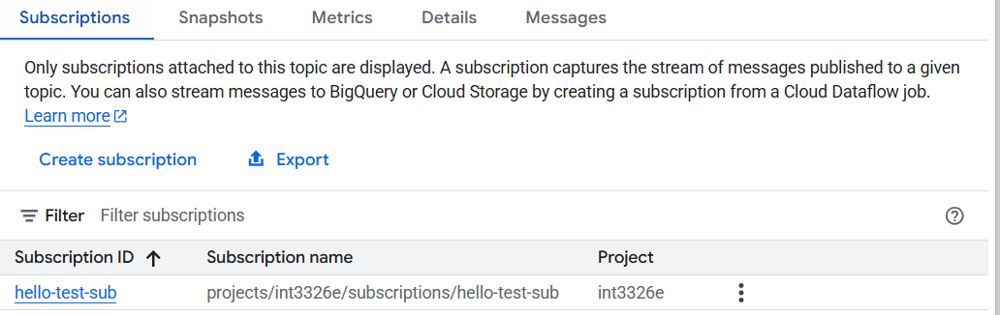

Ảnh 2 — Màn hình Pull nhận `Hello World`, publish time `Oct 8, 2026, 9:26:49 PM` (ảnh không hiển thị múi giờ); “Enable ack messages” chưa được chọn:

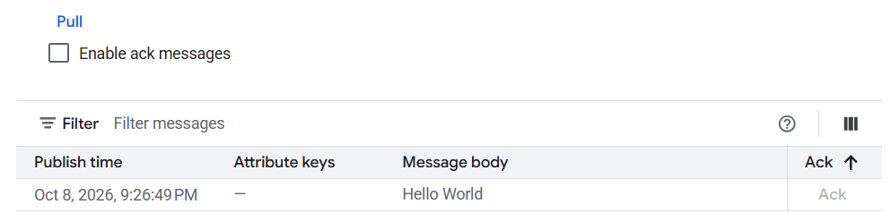

Ảnh bổ sung — Topic `hello-test` và subscription `hello-test-sub` trong project `int3326e`:

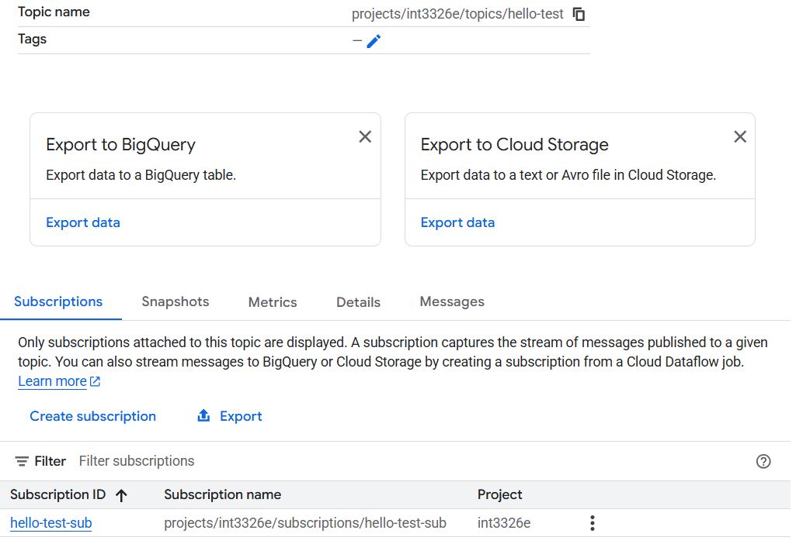

Ảnh bổ sung — Topic `hello-test` hiển thị thông báo `Message published.`:

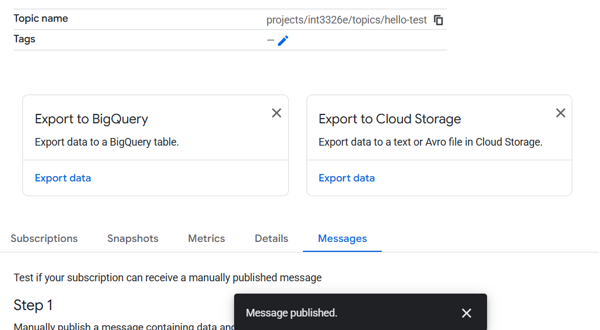

Ảnh bổ sung — Pull từ `projects/int3326e/subscriptions/hello-test-sub` nhận hai dòng `Hello World`, với publish time `Oct 8, 2026, 9:26:49 PM` và `Oct 9, 2026, 8:32:49 PM`:

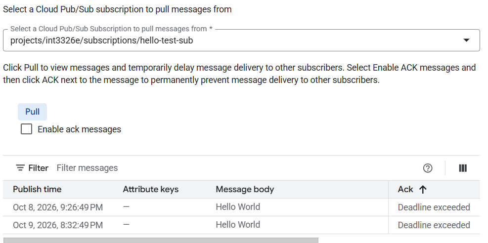

| Hạng mục | Bằng chứng | Kết luận |
| --- | --- | --- |
| Project, topic, subscription | Ảnh topic hiển thị `projects/int3326e/topics/hello-test` và subscription `hello-test-sub`. | Đã xác định resource thực tế của phép thử. |
| Publish | Ảnh có tên topic và thông báo `Message published.` | Có bằng chứng publish thành công; ảnh không hiển thị body gửi hoặc message ID để đối chiếu trực tiếp với lần pull. |
| Pull | Ảnh có tên subscription, body `Hello World` và thời điểm publish nêu trên. | Có bằng chứng nhận đúng nội dung; ảnh không hiển thị múi giờ nên giữ nguyên thời gian như trong ảnh. |
| ACK và worker | `Enable ack messages` chưa được chọn; cột Ack hiển thị `Deadline exceeded`; không có log worker. | Chưa có bằng chứng ACK thành công, worker xử lý hoặc ghi DB. Không đánh dấu các bước này đã đạt. |

### 6.2. GPS emitter trên `/driver`

Ảnh trạng thái ban đầu — URL `localhost:5173/driver`, tài xế `demo-driver-1`, trạng thái `Đã dừng`, số mẫu `0`, chưa có payload:

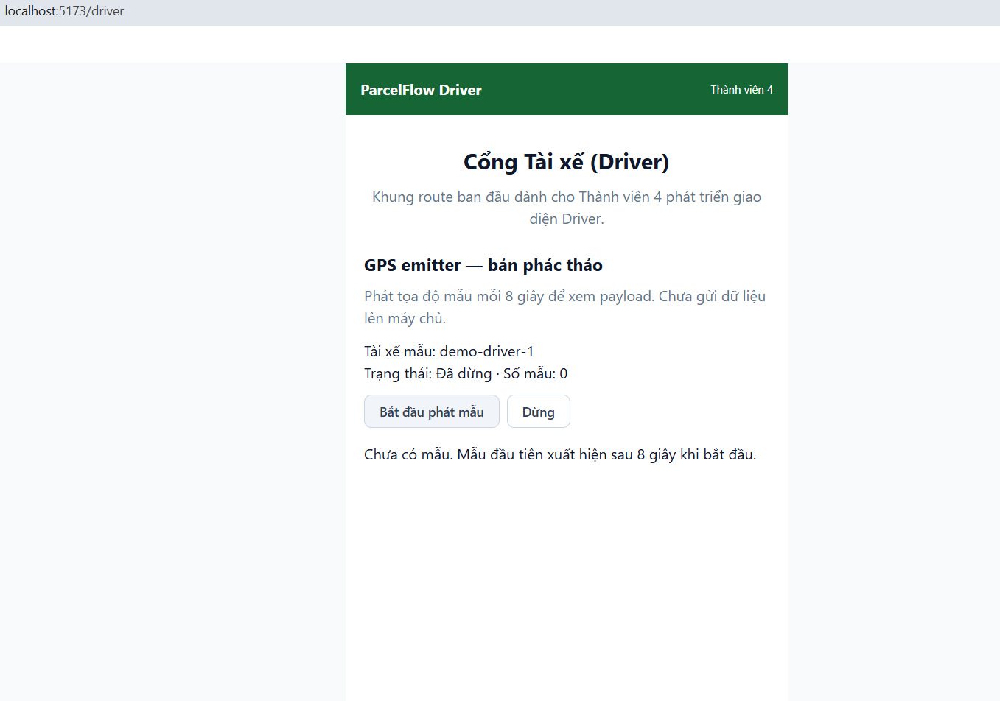

Ảnh mẫu thứ nhất — Trạng thái `Đang phát mẫu`, số mẫu `1`, payload đủ bốn trường, tọa độ `21.0285`, `105.8542` và timestamp `2026-10-09T13:38:17.266Z` (UTC):

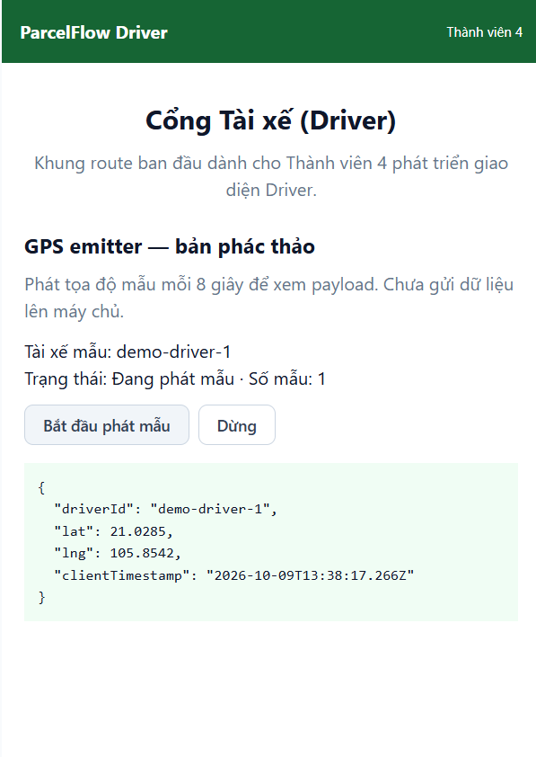

Ảnh đang phát — Trạng thái `Đang phát mẫu`, số mẫu `2`, tọa độ `21.0285`, `105.8542` và timestamp `2026-10-09T13:29:34.609Z` (UTC):

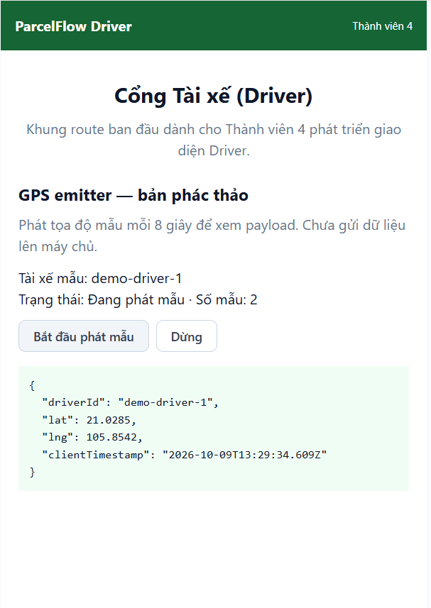

Ảnh sau khi dừng — Trạng thái `Đã dừng`, số mẫu `2`, payload và timestamp `2026-10-09T13:29:34.609Z` giữ nguyên so với ảnh đang phát:

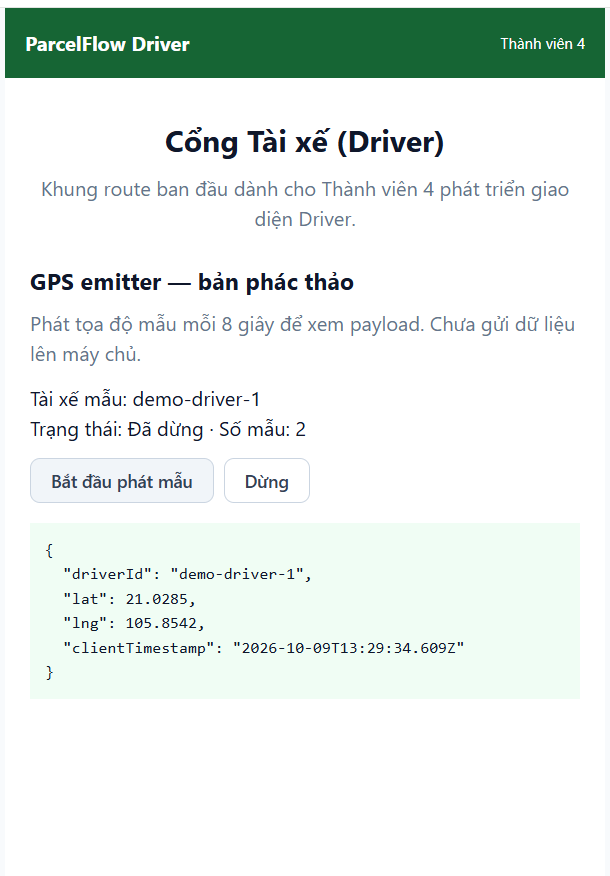

Ảnh được cung cấp với tên `driver-gps-stopped-after-10s.png` — Trạng thái `Đã dừng`, số mẫu `2`, timestamp `2026-10-09T13:26:50.157Z` (UTC):

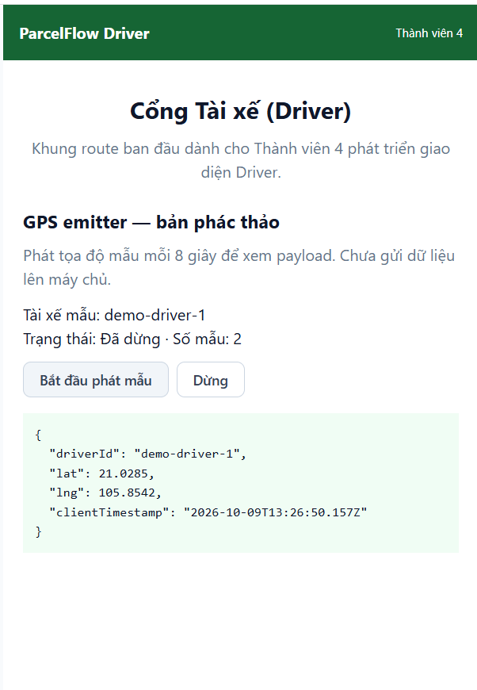

Ảnh mẫu thứ nhất được chụp ở lượt chạy sau ảnh hai mẫu: timestamp `13:38:17.266Z` so với `13:29:34.609Z`. Hai ảnh chứng minh giao diện ở từng trạng thái, nhưng không tạo thành cặp mẫu liên tiếp để đo chu kỳ 8 giây. Ảnh `driver-gps-stopped-after-10s.png` cũng thuộc lượt khác với cặp đang phát/dừng, nên chưa đủ đối chiếu payload trước và sau khoảng chờ. Cần video hoặc biên bản thao tác có thời gian để xác nhận chu kỳ phát và việc không tạo thêm mẫu sau khi dừng.

### 6.3. Kiểm tra kỹ thuật

Ảnh lệnh `npm run lint:web` gọi ESLint, không hiển thị lỗi trong phần được chụp:

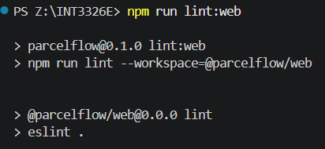

Ảnh lệnh `npm run build:web` chạy `tsc -b && vite build`, transform 158 module và kết thúc với `built in 218ms`:

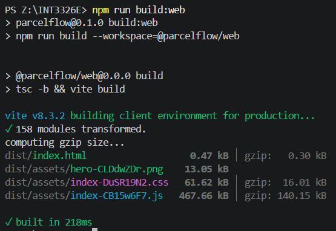

Kiểm tra độc lập trên repo ngày 09/10/2026: `npm run lint:web` và `npm run build:web` đều kết thúc với exit code `0`. Kết luận lint đạt dựa trên kết quả lệnh này; ảnh lint của TV4 chỉ hiển thị phần gọi ESLint. Ảnh build của TV4 thể hiện build thành công.

### 6.4. Đối chiếu bộ ảnh ngày 09/10/2026

| Ca kiểm tra | Kết quả đối chiếu bằng chứng hiện có | Phần cần xác nhận thêm |
| --- | --- | --- |
| TC-01 | Có ảnh trạng thái ban đầu dừng, `0` mẫu, chưa có JSON. | Ảnh tĩnh không xác nhận trực tiếp thuộc tính vô hiệu hóa của nút Dừng. |
| TC-02 | Có ảnh đang phát với số mẫu `1` và JSON đúng bốn trường. | Chưa có ghi nhận thời gian từ lúc bấm đến mẫu đầu tiên và việc không phát ngay khi bấm. |
| TC-03 | Có ảnh số mẫu `1` và `2`, cùng tọa độ mẫu nhưng ở các lượt chạy khác nhau. | Cần hai mẫu liên tiếp trong cùng lần chạy để đối chiếu timestamp và chu kỳ khoảng 8 giây. |
| TC-04 | Cặp ảnh đang phát/dừng giữ nguyên số mẫu `2` và payload. | Cần ghi nhận hoặc video chờ hơn 8 giây sau khi dừng; ảnh mang tên `stopped-after-10s` thuộc lượt khác. |
| TC-05 | Chưa có ghi nhận thao tác bắt đầu lại và bấm lặp. | Kiểm tra số mẫu tiếp tục tăng, chỉ một mẫu mỗi chu kỳ và không có timer trùng. |
| TC-06 | Chưa có ghi nhận đổi route trong lúc đang chạy. | Chuyển route rồi quay lại `/driver`, xác nhận trạng thái ban đầu. |
| TC-07 | Mã nguồn có điều kiện `driverId.trim()` để chặn định danh rỗng. | Chưa có kết quả chạy với định danh rỗng hoặc chỉ có khoảng trắng. |
| TC-08 | Mã nguồn tạo payload nội bộ; giao diện ghi rõ chưa gửi dữ liệu lên máy chủ. | Chưa có ghi nhận quan sát quyền vị trí và Network khi chạy. |
| TC-09 | Có ảnh resource, publish thành công và pull nhận `Hello World`; đã đạt theo yêu cầu cập nhật tuần 1. | Không yêu cầu chạy lại. |

Kết quả đối chiếu bộ ảnh ngày 09/10/2026: đã có bằng chứng Pub/Sub publish/pull và emitter hiển thị một mẫu, hai mẫu, chuyển sang trạng thái dừng, cùng lint/build đạt. Bộ ảnh phù hợp để minh họa phần phác thảo TV4 tuần 1; chưa đủ để xác nhận toàn bộ TC-01 đến TC-08. Kết quả kiểm thử component bổ sung được ghi tại mục 6.5.

### 6.5. Kiểm tra bổ sung ngày 10/10/2026

Kiểm thử component bằng React Test Renderer, mount trực tiếp `DriverPlaceholderPage` và chạy timer thật. Gói kiểm thử và script nằm trong thư mục tạm, không thêm dependency vào repo.

| Kiểm tra | Kết quả |
| --- | --- |
| Ghép emitter vào Driver | Trang Driver mount được emitter; ban đầu số mẫu `0`, Bắt đầu bật, Dừng tắt. |
| Start | Chỉ có một timer, Bắt đầu bị vô hiệu hóa, Dừng được bật; không tạo mẫu ngay khi bấm. |
| Hai mẫu liên tiếp | Timestamp `2026-10-10T04:28:15.362Z` và `2026-10-10T04:28:23.373Z`, cách nhau `8011 ms`; payload đúng bốn trường, `driverId` là `demo-driver-1`. |
| Stop | Timer được hủy; chờ `9000 ms` vẫn giữ nguyên số mẫu `2` và payload thứ hai. |
| Start lại | Sau một chu kỳ, số mẫu tăng thành `3`; chỉ có một timer. |
| Vòng đời | Unmount hủy timer; mount lại dừng ở `0` mẫu, chưa có JSON. |
| Định danh rỗng | `driverId` rỗng hoặc chỉ có khoảng trắng vô hiệu hóa Bắt đầu, không tạo timer. |
| Lint/build | `npm run lint:web` và `npm run build:web` đều kết thúc với exit code `0`. |

Start/Stop đạt ở mức component. Công cụ hiện không có trình duyệt kết nối, nên chưa bổ sung ảnh/video, kiểm tra chuyển route thực tế hoặc quan sát Network/quyền vị trí. Hello World giữ kết quả đã đạt, không chạy lại.

## 7. Điều kiện hoàn thành và bàn giao

Phạm vi Driver Frontend và GPS emitter tuần 1 được nghiệm thu khi:

- Giữ bằng chứng publish/pull `Hello World` đã đạt, xác định rõ topic và subscription thực tế; không chạy lại.
- GPS emitter trên `/driver` đạt TC-01 đến TC-08, có ảnh hoặc video thể hiện phát ít nhất hai mẫu và dừng phát.
- Lưu kết quả lint/build cùng các lỗi còn tồn tại, nếu có.
- Tài liệu và mã nguồn emitter được bàn giao, ghi rõ payload còn là bản nháp và bước tích hợp tiếp theo.

## 8. Bàn giao sang các tuần sau

| Tuần | Phạm vi phát triển theo bảng tiến độ | Điểm tích hợp |
| --- | --- | --- |
| 2 — D13 | Tiếp tục thử pipeline Pub/Sub, thống nhất schema GPS giữa Driver Frontend và GPS pipeline. | Contract request/event, timestamp, `eventId`, `seq`, `receivedAt` và nơi tạo từng trường. |
| 3 — D19 | Driver login/dashboard skeleton, phát thử GPS event. | Nối driver client với endpoint `POST /v1/locations` của backend theo contract cập nhật; ô D17 trong bảng tiến độ gốc còn ghi tên cũ. |
| 4 — D25 | Kết nối Driver app gửi GPS thật hoặc simulator toggle. | Frontend gọi REST; backend publish Pub/Sub, worker xử lý dữ liệu. |
| 5 — D31 | Xử lý GPS stale/invalid, bắt đầu phác thảo load test. | Chốt cách xử lý lỗi vị trí và lỗi gửi trước khi nghiệm thu pipeline đầy đủ. |

`POST /v1/locations` là endpoint theo contract cập nhật; các file controller/service/DTO của module location hiện còn rỗng. Spec tuần 1 không coi endpoint này đã hoạt động. Khi nối qua `apiClient`, dùng đường dẫn `/locations` vì base URL đã chứa `/v1`. Theo `frontend-spec.md`, khi tích hợp nghiệp vụ, emitter bắt đầu gửi GPS ở `PICKED_UP` và dừng khi đơn kết thúc (`DELIVERED` hoặc `DELIVERY_FAILED`); bản phác thảo hiện chưa kiểm tra trạng thái đơn hàng.

## 9. Tài liệu tham chiếu

- `ParcelFlow - Bảng theo dõi tiến độ.xlsx`, sheet `Tiến độ 10 Tuần`: D7, F4 và D13/D19/D25/D31.
- [Đặc tả frontend](frontend-spec.md): route Driver, luồng trạng thái và chu kỳ GPS.
- [Thiết kế frontend](frontend-design.md): frontend giao tiếp REST và kiến trúc Pub/Sub.
- [README](../README.md): kiến trúc GPS và roadmap MVP.
- [GpsEmitter.tsx](../apps/web/src/features/driver/GpsEmitter.tsx) và [types dùng chung](../packages/types/src/index.ts): đối chiếu hành vi và payload hiện có.
